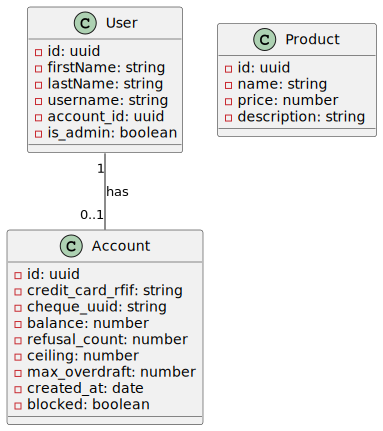
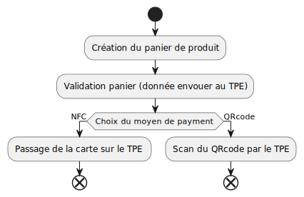
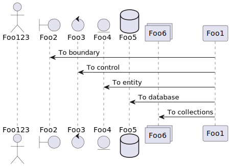

# PlantUML diagrams

[Website](https://plantuml.com/)

[Visual Studio Code extension](https://marketplace.visualstudio.com/items?itemName=jebbs.plantuml)

## Class diagram

## Architecture diagram

## activity diagram

