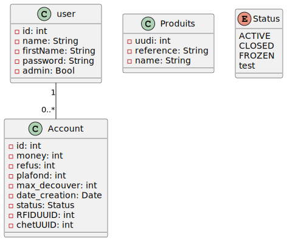
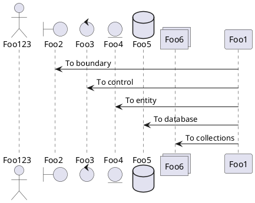

# doc pour les diagrammes puml :

https://plantuml.com/fr/

(installer `jebbs.plantuml` dans vscode)

# 1er esquice du diagrame de class

# 1er esquisse du diagramme d'architecture

# exemple dans le md

